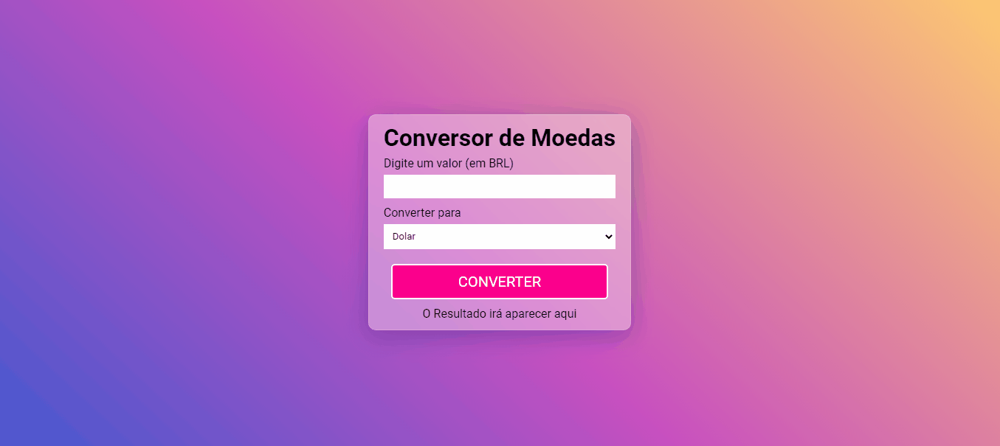

<h1 align="center">
    Conversor Monetário
</h1>

## 📃 Sobre

Projeto feito para realizar a conversão monetária de valores em tempo real através da API do AwesomeAPI que retorna o valor da cotação da moeda em tempo real.

---

## 🚀 Tecnologias utilizadas

O projeto foi desenvolvido com as seguintes tecnologias:

- HTML
- CSS
- JS

---

## 📷 Imagens

<h1 align="center">
    
</h1>

## 📁 Como baixar o projeto

```bash
    # Clonar o repositório
    $ git clone https://github.com/EnzoXavier1001/conversor-moedas
    # Entrar no diretório
    $ cd conversor_moedas
```